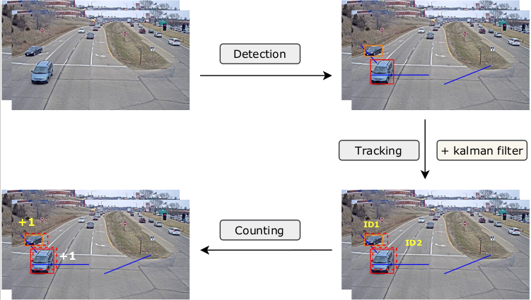

### Efficient Multiple traffic modalities counting

The goal of this repository is to count multiple traffic modalities (car, truck, pedestrians, and cyclists) with a model that is as small as possible while maintaining high accuracy. 

Our counting framework follows detecting, tracking, and counting as shown in the figure below:

##### Detail

- To show how our counting algorithm work, I used a surveillance video that is taken from YouTube (https://www.youtube.com/watch?v=MNn9qKG2UFI&t=6s) in the tutorial. The counting visualization is at: https://drive.google.com/file/d/1A6RzYPutqLcP8w5-IJFAhhzV4mUuzcpq/view?usp=sharing

##### TODO
- [x] traffic counting tutorial on youtube video
- [ ] update clean code
- [ ] deploy it on edge device, report inference speed

